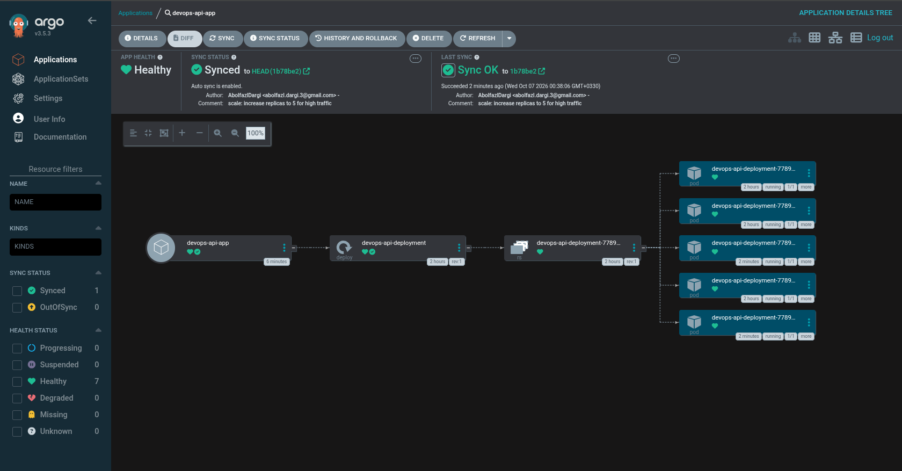

# Enterprise Cloud-Native GitOps Platform

This repository demonstrates a Senior-level, production-ready CI/CD and GitOps pipeline. It showcases a modern approach to infrastructure deployment, security automation, and high-availability application management using Kubernetes.

## 🏗️ Architecture & Tech Stack
* **Containerization:** Docker (Multi-stage, non-root security)
* **DevSecOps (CI):** GitHub Actions, Trivy Vulnerability Scanner
* **Container Orchestration:** Kubernetes (Multi-node via `kind`)
* **Continuous Delivery (GitOps):** ArgoCD
* **Application:** Node.js Microservice

## 🚀 Key Features Implemented

1. **Automated Security Scanning (Shift-Left Security):**
   - GitHub Actions pipeline automatically builds and scans the Docker image using Aqua Security's **Trivy**.
   - Pipeline is strictly configured to **FAIL** on `CRITICAL` or `HIGH` OS/library vulnerabilities, preventing insecure deployments.

2. **GitOps Single Source of Truth:**
   - **ArgoCD** continuously monitors the `k8s/` directory in this repository.
   - Any modifications to the manifest files (e.g., scaling replicas, updating image tags) are automatically synced and reconciled in the Kubernetes cluster without manual `kubectl` intervention.

3. **High Availability & Self-Healing:**
   - Deployed as a multi-replica Kubernetes `Deployment` balanced by a `ClusterIP Service`.
   - Engineered for zero-downtime; the cluster automatically provisions new Pods if a node or container fails.
   - Configured with robust `livenessProbe` and `readinessProbe` health checks, plus precise CPU/Memory resource constraints.

## 📊 GitOps in Action
*(Screenshot of ArgoCD automatically syncing 5 replicas based on the GitHub repository state)*

